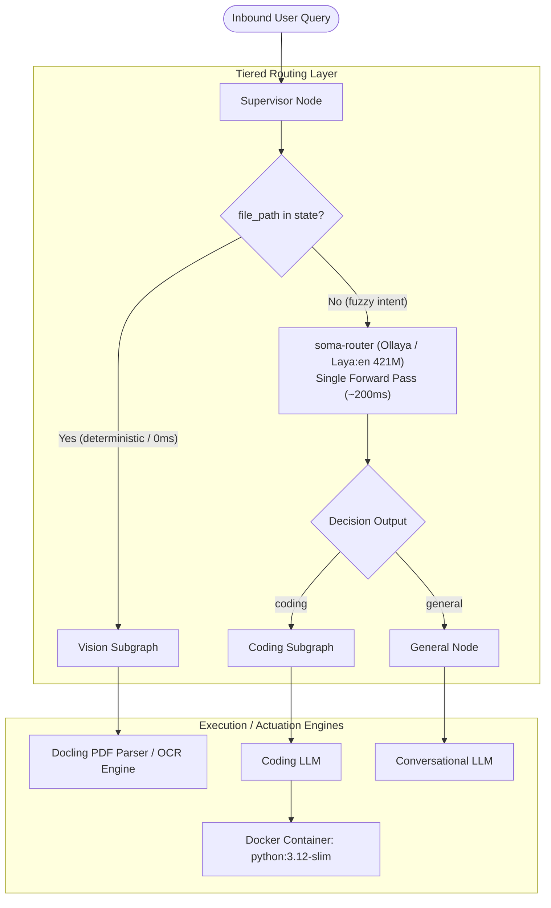

<h1 align="center">soma v0.15</h1>
<p align="center">An agentic workbench for keeping your sensitive data off the cloud, while still giving you access to the latest and greatest open source models</p>

<video src="https://github.com/user-attachments/assets/a9c5f270-9870-4d6b-a4b7-1f0c40621759" controls="controls" width="100%"></video>

> **Note**: Recorded during the initial prototype phase for this project, showcasing the end-to-end agent workflow, Docling OCR integration, and containerized Docker sandbox before the supervisor latency refactor.

## What this is
This is the backend server and logic for **soma** - an agentic workbench, specifically suited for industry workers that lets you access open source models with multimodal routing, capable of maintaining zero outbound connections and zero API costs, all run in air-gapped, local hardware.

## Built with
The core workflow (inside `logic/`) was built using LangGraph, with OCR support from docling. We use `qwen-2.5:7b` for both coding related tasks and general queries. For testing purposes we sometimes also resort to `gemini-3.8-flash-high` served via Google's endpoint. Most interestingly, we use a **decision model** named [laya](https://huggingface.co/convaiinnovations/laya) to categorise the incoming user prompt to detect whether it's a coding task or not. More info in [Architecture](#architecture).

The server itself uses FastAPI to expose the workflow.

## Architecture

- At first we were using naive prompt routing, spinning up a 7b param autoregressive generative model (either qwen or gemini), wait 2-3+ seconds for sequential token generation and memory-bandwidth bound KV cache loads and force it to produce JSON using LangGraph's `with_structured_output`.
- This was replaced using a much faster approach:
  - A single CPU instruction routes document at 0ms cost (`state.get('file_path')`).
  - Ambiguous text queries hit `soma-router` which is a 421M param `laya:en` model running locally via `ollaya` on CPU using ONNX. The transformer evaluates classification heads in a **single forward pass** (see benchmark below) emitting strictly typed decisions (`coding` vs `general`) with zero generative overhead.
  - The model footprint is 854MB of RAM for `soma-router` (configured laya) compared to ~4GB for a basic autoregressive LLM that I was using before (`qwen2.5:3b`).
 
### Benchmark: supervisor routing latency and footprint
Benchmarked on an AMD Ryzen 3 5300U (4C/8T, CPU-only execution) across 50 iterations with 3 warmup runs discarded (`tests/router_benchmark.py`):
| Metric / Dimension | Naive Generative Router (`qwen2.5:3b`) | Decision Router (`soma-router` / `laya:en`) | Delta |
| :--- | :--- | :--- | :--- |
| **Execution Model** | Autoregressive Token-by-Token Decoding | Non-Autoregressive Single Forward Pass | Zero KV-cache overhead |
| **p50 latency (median)** | `1,380.5 ms` | `221.7 ms` | **6.2x faster** (-84% latency) |
| **p90 latency** | `1,398.4 ms` | `259.9 ms` | **5.4x faster** |
| **p99 latency (tail)** | `1,411.1 ms` | `272.8 ms` | **5.2x faster** (tight 51ms jitter) |
| **Memory footprint (RAM)** | ~2.5 – 4.0 GB | `854 MB` | ~75% memory reduction |

 What I learned was that decision models are much better than LLMs at a certain kind of task - when you need probabilistic inference on low latency for some if/else question. This can reduce API costs as well as inference latency, and is also less time consuming than training one's own classifier. Using generative LLMs for this use case might be an anti-pattern in the future.

## Test it locally
To test the server locally:
### Setup and install deps and environment variables
1. Clone the repository:
   ```bash
   git clone https://github.com/cosmognaut/soma-server.git
   cd soma-server
2. Make sure that you have `uv` installed. Sync dependencies using it:
   ```bash
   uv sync
   ```
   This may take some time because it installs `torch` among other things, which is a heavy library. You may want to use `uv venv` before but `uv sync` automatically does that for you. You might want to activate it using `source .venv/bin/activate` on macOS/Linux or `.venv\Scripts\activate` on Windows.
3. Now edit the `.env` using your own values. If you are using the official APIs, refer to the LangGraph docs.
   ```bash
   vim .env
   ```
   An example is given below:
   ```env
   MY_ENDPOINT=...
   API_KEY=...
   # optional, only if you want a local tunnel
   CLOUDFLARED_TOKEN=...
   ```
   You're now all set!
### Set up the local decision router (Ollaya)
The supervisor routing layer requires [Ollaya](https://ollaya.dev) running locally to serve `soma-router`:
1. Install Ollaya via the official installer, visit the website for this.
2. Pull the base English weights:
   ```bash
   ollaya pull laya:en
   ```
3. Build the `soma-router` model artifact using the repository's `Modelfile`
   ```bash
   ollaya create soma-router -f Modelfile
   ```
4. Now run the ollaya server in the background:
   ```bash
   ollaya serve
   ```
### Running the server
1. The entrypoint has already been set in the `pyproject.toml`. Just run the `fastapi` command now:
   ```bash
   fastapi dev
   ```
2. Visit `http://localhost:8000/docs` for the Swagger docs generated by FastAPI.

## Limitations
1. We are not using any VLM right now, so "true" vision tasks don't work. But because Docling itself is a fully functioning local model that's running on my PC, OCR and text-related tasks work well (even though scanned documents may take some time to be processed).
2. If the user uploads a big file now (> maybe 50 pages?) my server crashes even with `Semaphore(1)` because of the kernel triggering OOM. This is easily fixable if I move this server to a better PC with an actual GPU, but it seems that I can't do that right now.
3. No server persistence. We are not using RAG for now, so persistence via Qdrant or something else doesn't make sense. The client captures the entire conversation history in their requests, so we're not even using LangGraph's checkpointers for saving memory.
4. This is a minor one but is still worth mentioning - we don't stream any errors to the client right now.
